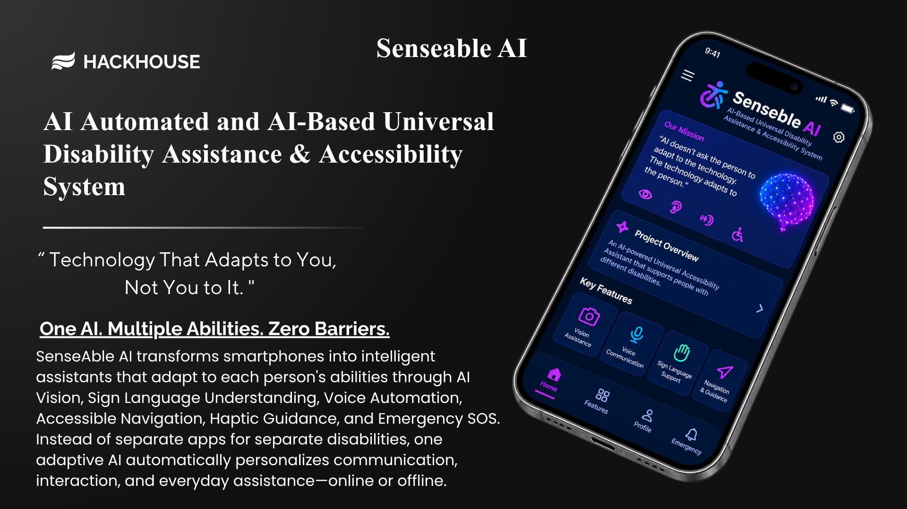
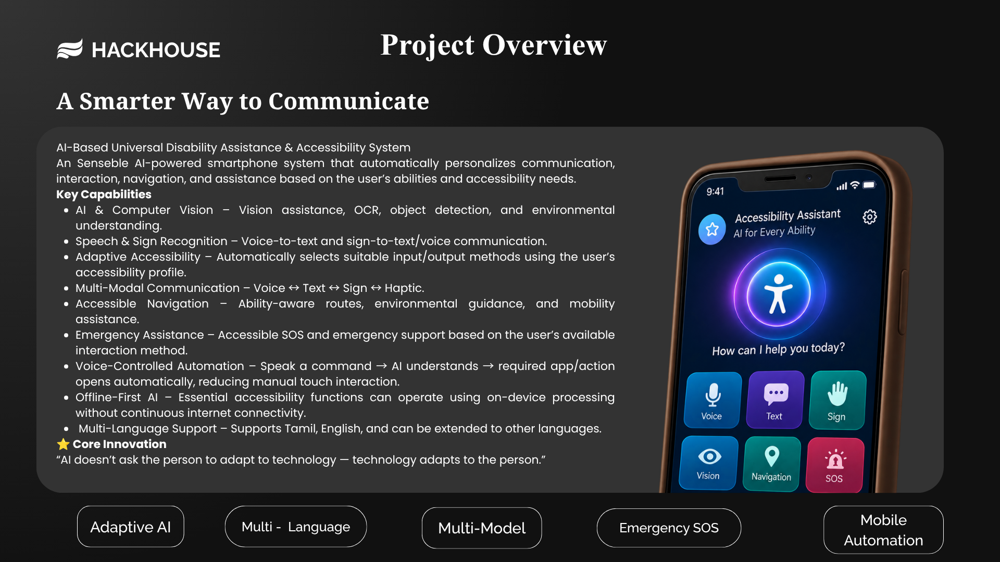
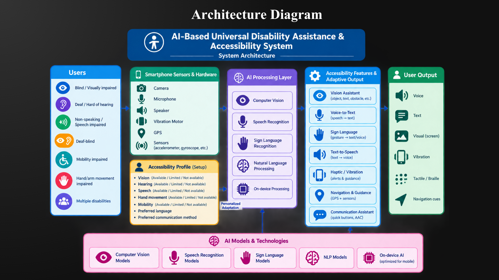
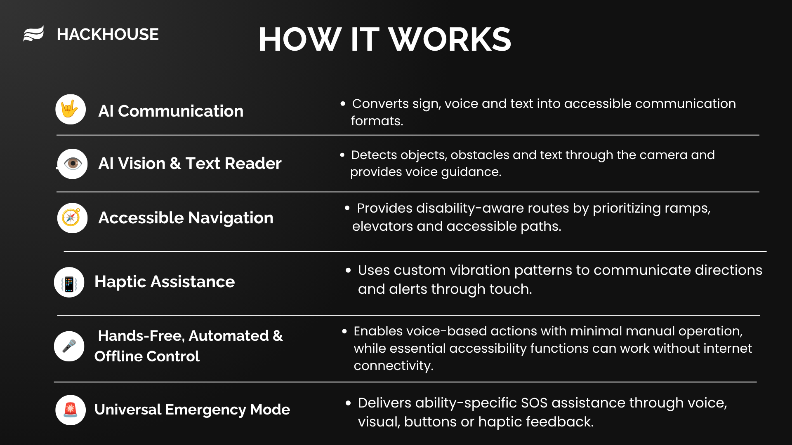
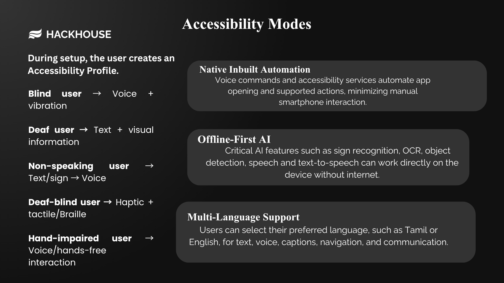
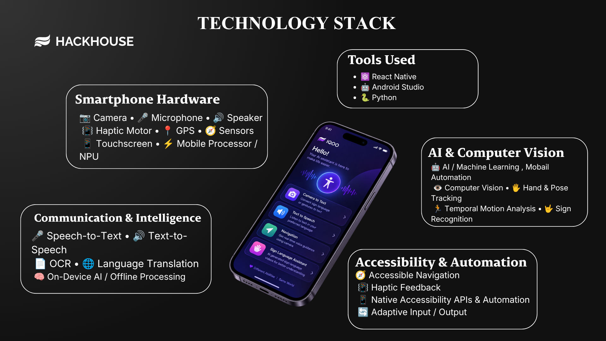
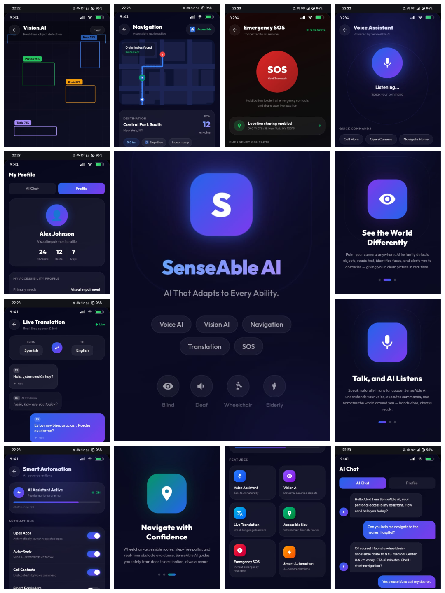

# SenseAble AI

### AI-Powered Universal Accessibility & Automation Platform

> **Technology That Adapts to You, Not You to It.**

SenseAble AI transforms smartphones into intelligent assistants that adapt to each person's abilities through AI Vision, Sign Language Understanding, Voice Automation, Accessible Navigation, Haptic Guidance, and Emergency SOS. Instead of separate apps for separate disabilities, one adaptive AI automatically personalizes communication, interaction, and everyday assistance—online or offline.

**One AI. Multiple Abilities. Zero Barriers.**

---

## Live Prototype

🔗 https://hall-zebra-89727725.figma.site/

---

## Project Overview

SenseAble AI is an AI-powered universal accessibility platform that creates a personalized smartphone experience for people with visual, hearing, speech, mobility, and multiple disabilities.

### Core Capabilities

- AI Vision & Computer Vision
- Sign Language Recognition
- Speech ↔ Text ↔ Voice Communication
- Voice-Controlled Mobile Automation
- Accessible Navigation
- Haptic Guidance
- Emergency SOS
- Offline-First AI
- Multi-Language Support

---

## Architecture

The system combines smartphone hardware, AI models, computer vision, speech processing, navigation, and accessibility APIs to deliver a unified adaptive assistance experience.

---

## How It Works

SenseAble AI intelligently adapts interaction methods based on the user's accessibility profile.

### AI Workflow

1. User interacts through voice, camera, sign language, or touch.
2. AI understands the user's accessibility needs.
3. The system selects the most suitable communication method.
4. Essential tasks are automated with minimal manual interaction.
5. The user receives voice, text, visual, or haptic feedback.

---

## Accessibility Modes

| User | AI Assistance |
|------|---------------|
| Blind / Low Vision | Voice Guidance + Vibration |
| Deaf / Hard of Hearing | Live Captions + Visual Information |
| Non-speaking | Text/Sign → Voice |
| Deaf-Blind | Haptic Feedback |
| Hand-Impaired | Voice-Controlled Interaction |

---

## Technology Stack

### Mobile

- React Native
- Android Studio

### AI & Machine Learning

- Python
- Computer Vision
- OCR
- Sign Language Recognition
- Speech Recognition
- On-Device AI

### Hardware Integration

- Camera
- Microphone
- Speaker
- GPS
- Haptic Motor
- Motion Sensors

---

## Prototype

The prototype demonstrates how SenseAble AI adapts its interface and assistance methods for different accessibility needs through a unified smartphone experience.

---

## Why SenseAble AI?

Unlike traditional accessibility apps that solve only one problem, SenseAble AI combines multiple accessibility solutions into a single adaptive AI platform.

### What Makes It Different

- One system for multiple disabilities
- Ability-aware AI personalization
- Offline-first accessibility
- Zero-manual voice automation
- Multi-modal communication
- Emergency assistance that adapts to the user's abilities

---

## Future Roadmap

- Real-time continuous sign language conversations
- Smarter AI navigation
- Wearable integration
- Advanced on-device AI
- Expanded language support
- Personalized AI learning for each user

---

## Vision

> **Technology should adapt to people—not the other way around.**

SenseAble AI aims to redefine accessibility by making AI-powered communication, navigation, automation, and assistance available through one intelligent platform for everyone.
